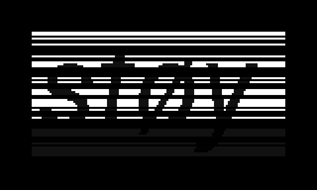

# støy

(/stœj/) is noise

skittering, scratching, sputtering sounds from a trio of oscillators that respectively feed, fm and am a filter, there is feedback and a delay if you want. a button makes it all (except the delay) stop.

i made this to see if i could play the same kind of music on norns as i have done for years on my modular, they both feel similar, familiar, but also different.

if you want you can play too

requires norns, grid optional

e1 pitch
e2 chooses
e3 affects

k1+e1 res eq dry/wet  
k1+row decay time  
k1+e2 delay rate  
k1+e3 delay feedback  

k2 momentary delay send  
k3 momentary mute  

install from maiden or download to ‘dust/code’, then restart norns

